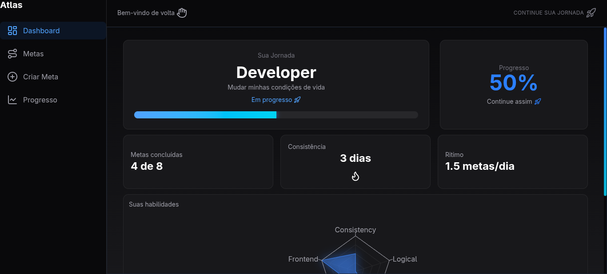
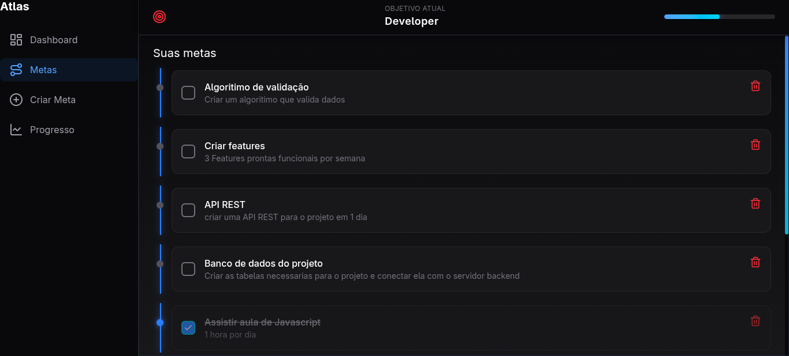
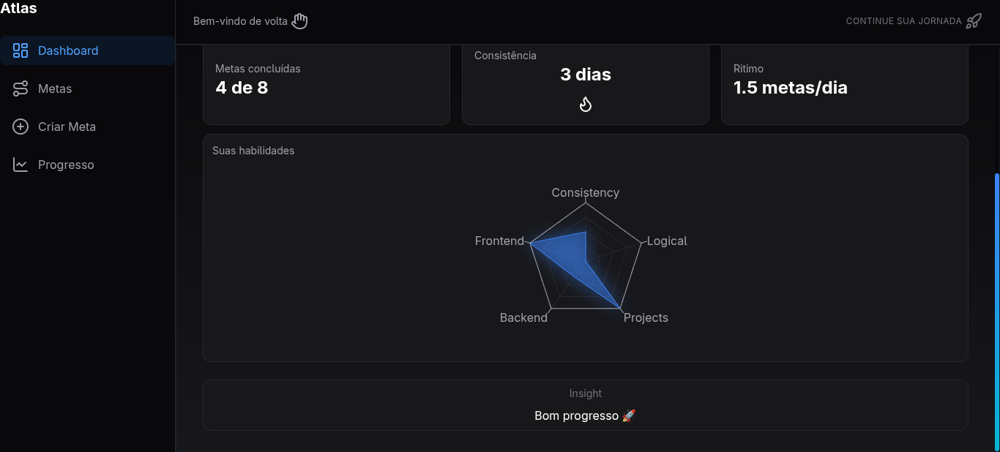

# 🚀 Atlas — Goal Tracking Platform

**Code name:** Project Atlas

Atlas is a web platform designed to help people turn goals into real progress.

Instead of just listing tasks, it breaks down objectives into structured steps, tracks performance, and provides visual insights into personal growth.

---

## ✨ Why this project exists

This project was born from a real problem:

> It's easy to set goals.  
> It's hard to follow through.

Atlas was built to solve that — creating a system that encourages consistency, clarity, and measurable progress.

---

## 🧠 Core Features

- 🎯 **Dynamic Goal System**
  - Create objectives and break them into actionable goals
  - Categories adapt based on the user’s objective

- 📊 **Real-Time Dashboard**
  - Progress tracking
  - Consistency tracking (streaks)
  - Daily performance (goals/day)

- 🧭 **Skills Radar Chart**
  - Visual representation of user growth
  - Based on real completed goals
  - Fully dynamic (changes per objective)

- 🧩 **Smart Categorization**
  - Categories generated based on objective context
  - Supports different life areas (e.g. programming, finance, etc.)

- ⚡ **Fullstack Integration**
  - Frontend + Backend fully connected
  - Real data flow (no mock data)

---

## 🛠 Tech Stack

- **Frontend:** React + TypeScript + TailwindCSS  
- **Backend:** Node.js + Express  
- **Database:** PostgreSQL  
- **Authentication:** JWT  

---

## 📸 Preview

> (Add screenshots here — this is VERY important)

### Dashboard


### Goals System


### Skills Radar


---

## 🚧 Current Status

**Version:** 1.0 (in progress)

This project is actively being developed with new features focused on intelligence and user engagement.

---

## 🔮 Next Steps

- 🧠 AI-assisted goal suggestions (SMART methodology)
- 🏆 XP & reward system
- ✅ Goal validation system (proof-based completion)
- 📈 Advanced analytics

---

## 🧪 Local Setup

```bash
# Clone repository
git clone https://github.com/lucas-brisolla/goal-tracker.git

# Install dependencies
cd atlas-frontend
npm install

cd ../atlas-backend
npm install

# Run project
npm run dev

🤝 Contributing

Contributions, ideas, and feedback are welcome.

If you have suggestions or want to collaborate, feel free to open an issue.

📬 Contact
Email: lucasabrisolla@gmail.com
LinkedIn: (add here depois)
📄 License

This project is licensed under the MIT License.
